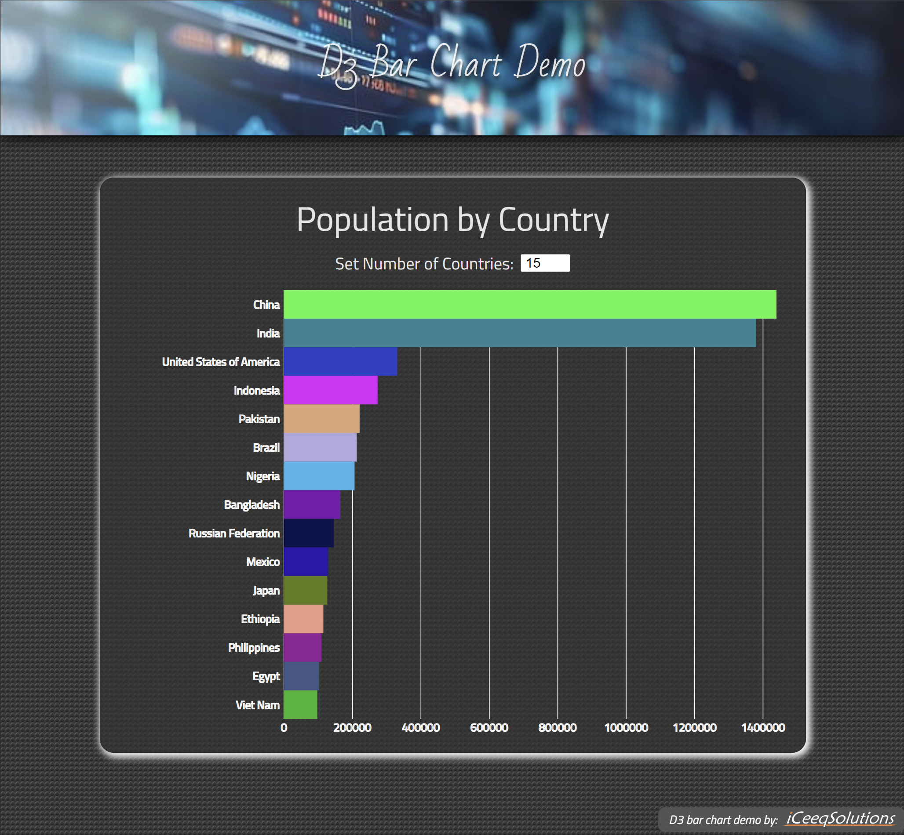

# D3 Bar Chart - React demo application with GitHub Gist connection.

  Bar Chart Demo by <a href="https://iceeqsolutions.fi/">iCeeqSolutions</a>

## About

D3 Bar Chart demo shows how the D3.js library can be used to visualize data. In this bar chart, we have used UN Population data in csv format that was available on GitHub Gist.

By using the input field, users are able to change the number of countries shown in the graph.

## Demo

👁️ [Live Demo](https://d3-bar-chart.iceeqsolutions.fi/)

## Built with

- JavaScript
- CSS
- Vite
- React
- NPM
- SVG
- D3.js
- GitHub Gist
- ESLint
- Prettier

## Features

- Interactive bar chart
- Form element
- SVG elements

  

  
